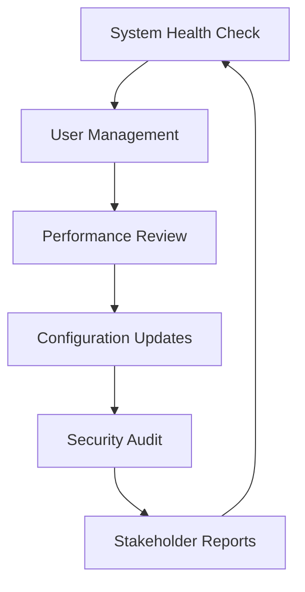

# Administrator Hub

Welcome to your SmartWinnr command center! As an administrator, you're the strategic architect of your organization's learning ecosystem, ensuring optimal performance, security, and user experience across the entire platform.

## Your Administrative Command Center

### **User & Access Management**

Control who has access to what, ensuring security while enabling productivity.

  

    <h3>User Management</h3>
    
Create, configure, and manage user accounts with role-based permissions and bulk operations.

    
<a href="/admin/create-users-individually">Manage Users </a>

  

  
  

    <h3>Organization Setup</h3>
    
Configure company structure, departments, teams, and reporting hierarchies.

    
<a href="/admin/how-to-add-a-new-division">Setup Organization </a>

  

  
  

    <h3>Security & Permissions</h3>
    
Manage access controls, password policies, and security configurations.

    
<a href="/admin/manage-password-policy">Security Settings </a>

  

### **System Configuration**

Fine-tune platform settings for optimal performance and user experience.

  

    <h3>Branding & Customization</h3>
    
Configure company branding, themes, and visual customizations across the platform.

    
<a href="/admin/how-to-change-company-logo">Brand Configuration </a>

  

  
  

    <h3>Notifications & Communications</h3>
    
Set up automated notifications, email templates, and communication workflows.

    
<a href="/admin/custom-notifications">Manage Notifications </a>

  

  
  

    <h3>Integration Management</h3>
    
Configure connections with HR systems, LMS platforms, and third-party tools.

    
<a href="/admin/advanced-options-for-projects">Setup Integrations </a>

  

### **Analytics & Insights**

Monitor system performance and gain insights into organizational learning patterns.

  

    <h3>System Analytics</h3>
    
Track platform usage, performance metrics, and organizational learning trends.

    
<a href="/reports/detailed-explanation-of-reports">View System Reports </a>

  

  
  

    <h3>User Activity</h3>
    
Monitor user engagement, login patterns, and platform adoption across teams.

    
<a href="/reports/user-login-reports">Track User Activity </a>

  

  
  

    <h3>Performance Monitoring</h3>
    
Track resource usage, system health, and optimize platform performance.

    
<a href="/admin/how-to-track-my-organizational-resource-usage">Monitor Resources </a>

  

## Quick Start Guide

### **New Administrator Setup**

1. **Configure Organization**: Set up company profile and branding
2. **Import Users**: Bulk import user accounts and assign roles
3. **Security Setup**: Configure password policies and access controls
4. **Analytics Review**: Set up dashboards and reporting schedules
5. **System Optimization**: Fine-tune settings for your organization

**Get Started**  [Administrator Onboarding Guide](./getting-started/admin-onboarding)

### **Administrative Workflow**

## System Health Dashboard

### **Critical Metrics to Monitor**

- **System Performance**: Response times, uptime, and resource usage
- **User Activity**: Active users, login frequency, and engagement levels
- **Content Usage**: Most popular content and completion rates
- **Security Status**: Access patterns and security event monitoring
- **Growth Trends**: User growth and feature adoption over time

### **Administrative Analytics**

  

    <h3>Executive Dashboard</h3>
    
High-level metrics and KPIs for leadership reporting and strategic planning.

    
<a href="/reports/widgets">Executive Reports </a>

  

  
  

    <h3>User Insights</h3>
    
Detailed user behavior analytics, adoption patterns, and engagement trends.

    
<a href="/admin/search-users">User Analytics </a>

  

  
  

    <h3>Audit Trail</h3>
    
Complete activity logs, security events, and compliance tracking.

    
<a href="/admin/how-to-view-an-audit-log">View Audit Logs </a>

  

## Advanced Administrative Features

### **Automation & Workflows**

- **User Provisioning**: Automatic account creation from HR systems
- **Role Assignment**: Rule-based permission allocation
- **Notification Automation**: Smart alerts based on system events
- **Report Scheduling**: Automated report generation and distribution
- **Compliance Monitoring**: Automated tracking of regulatory requirements

### **System Optimization**

- **Performance Tuning**: Database optimization and caching strategies
- **Load Balancing**: Resource allocation for peak usage periods
- **Security Hardening**: Advanced threat protection and monitoring
- **Backup Management**: Automated data backup and recovery procedures
- **Capacity Planning**: Resource scaling based on growth projections

### **Enterprise Features**

- **Multi-Tenant Management**: Separate environments for different divisions
- **API Management**: Custom integrations and third-party connections
- **Advanced Analytics**: Custom reporting and business intelligence
- **White-Label Options**: Complete platform customization and branding
- **Enterprise Security**: SSO, LDAP integration, and advanced auth

## Administrative Best Practices

### **Security First**

- **Regular Audits**: Monthly review of user access and permissions
- **Password Policies**: Enforce strong authentication requirements
- **Data Protection**: Implement comprehensive data security measures
- **Compliance Monitoring**: Stay current with regulatory requirements
- **Incident Response**: Maintain procedures for security events

### **User Experience Focus**

- **Smooth Onboarding**: Streamlined new user setup processes
- **Clear Communication**: Regular updates about system changes
- **Training Support**: Comprehensive user education programs
- **Feedback Integration**: Act on user suggestions and complaints
- **Performance Optimization**: Ensure fast, reliable system performance

### **Data-Driven Management**

- **Metrics Monitoring**: Regular review of key performance indicators
- **Trend Analysis**: Identify patterns in user behavior and system usage
- **Proactive Maintenance**: Address issues before they impact users
- **Strategic Planning**: Use data to guide platform development
- **ROI Measurement**: Track learning impact on business outcomes

## Administrative Resources

### **Administrator Training**

  

    <h3>Documentation Hub</h3>
    
Complete guides for all administrative functions and system configurations.

    
<a href="/admin/index">Admin Documentation </a>

  

  
  

    <h3>Technical Guides</h3>
    
In-depth technical documentation for integrations and advanced configurations.

    
<a href="/troubleshooting/index">Technical Support </a>

  

  
  

    <h3>Admin Community</h3>
    
Connect with other SmartWinnr administrators and share best practices.

    
<a href="mailto:admin-support@smartwinnr.com">Admin Network </a>

  

### **Support & Escalation**

- **Priority Support**: Direct access to technical support team
- **Emergency Response**: 24/7 support for critical system issues
- **Implementation Services**: Expert assistance for complex deployments
- **Training Programs**: Comprehensive administrator certification
- **Strategic Consulting**: Platform optimization and best practice guidance

## System Architecture Overview

### **Platform Components**

| Component | Purpose | Administrator Role |
|-----------|---------|-------------------|
| **User Management** | Account lifecycle | Create, modify, deactivate users |
| **Content Management** | Learning materials | Approve, organize, archive content |
| **Analytics Engine** | Data processing | Configure reports, set KPIs |
| **Security Layer** | Access control | Manage permissions, audit access |
| **Integration Hub** | External connections | Configure APIs, manage data flows |

### **Data Flow Management**

- **User Data**: Profile management and privacy controls
- **Learning Data**: Progress tracking and performance analytics
- **System Data**: Platform usage and performance metrics
- **Integration Data**: External system synchronization
- **Audit Data**: Security and compliance logging

## Compliance & Governance

### **Regulatory Compliance**

  

    <h3>Data Privacy</h3>
    
GDPR, CCPA, and other privacy regulation compliance tools and reporting.

    
<a href="/admin/changing-updating-configuration-for-an-organization">Privacy Settings </a>

  

  
  

    <h3>Audit & Reporting</h3>
    
Comprehensive audit trails and compliance reporting for regulatory requirements.

    
<a href="/admin/how-to-view-an-audit-log">Compliance Reports </a>

  

  
  

    <h3>Security Standards</h3>
    
Industry security standards implementation and monitoring.

    
<a href="/admin/manage-password-policy">Security Compliance </a>

  

### **Data Governance**

- **Data Classification**: Categorize and protect sensitive information
- **Retention Policies**: Automated data lifecycle management
- **Access Controls**: Granular permissions and role-based security
- **Backup & Recovery**: Comprehensive data protection strategies
- **Incident Response**: Procedures for security and privacy events

## Strategic Planning & ROI

### **Business Impact Measurement**

**Learning ROI Metrics**

- **Performance Improvement**: Pre/post training effectiveness
- **Cost Reduction**: Training cost per employee optimization
- **Time to Competency**: Faster employee skill development
- **Business Outcomes**: Learning impact on key business metrics
- **Employee Satisfaction**: Engagement and retention improvements

**System ROI Analysis**

- **Platform Efficiency**: Reduced training delivery costs
- **Time Savings**: Automated processes and self-service capabilities
- **Scalability**: Support for organizational growth
- **Integration Value**: Streamlined workflows and data consistency
- **Strategic Alignment**: Platform support for business objectives

### **Future Planning**

- **Capacity Forecasting**: Plan for user growth and feature expansion
- **Technology Roadmap**: Stay current with platform developments
- **Integration Strategy**: Plan for new system connections
- **Change Management**: Prepare organization for platform evolution
- **Budget Planning**: Optimize costs while maximizing value

---

## Your Strategic Impact

As a SmartWinnr administrator, you're not just managing a systemyou're enabling organizational transformation through learning. Your work directly impacts:

- **Strategic Goals**: Aligning learning with business objectives
- **Employee Development**: Empowering workforce capability growth
- **Data-Driven Decisions**: Providing insights that drive strategy
- **Risk Management**: Protecting organizational data and compliance
- **Operational Excellence**: Optimizing processes for maximum efficiency

Your administrative excellence creates the foundation for organizational success through learning!

  <h3>Master SmartWinnr Administration</h3>
  
Ready to optimize your organization's learning platform?

  
<a href="/getting-started/admin-onboarding" style={{fontSize: '1.2rem', fontWeight: 'bold'}}>Start Your Admin Journey </a>

### **Administrator Emergency Contacts**

- **Critical Issues**: [urgent-support@smartwinnr.com](mailto:urgent-support@smartwinnr.com)
- **Security Incidents**: [security@smartwinnr.com](mailto:security@smartwinnr.com)  
- **Technical Support**: [admin-support@smartwinnr.com](mailto:admin-support@smartwinnr.com)
- **Implementation**: [implementation@smartwinnr.com](mailto:implementation@smartwinnr.com)
