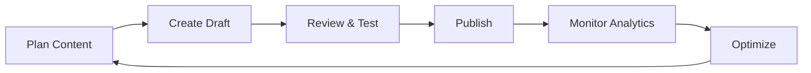

# Editor & Trainer Hub ✏️

Welcome to your content creation command center! As an editor or trainer, you're the architect of learning experiences that drive knowledge, engagement, and performance across your organization.

## Your Creative Toolkit 🛠️

### 📝 **Quiz & Assessment Creation**
Design engaging assessments that test knowledge and drive learning outcomes.

  

    <h3>🎯 Quiz Builder</h3>
    
Create interactive quizzes with 10+ question types, immediate feedback, and detailed analytics.

    
<a href="/quiz/creating-quiz">Create Your First Quiz →</a>

  

  
  

    <h3>❓ Question Bank</h3>
    
Build reusable question libraries, import from templates, and collaborate with other creators.

    
<a href="/quiz/managing-questions">Manage Questions →</a>

  

  
  

    <h3>📊 Assessment Analytics</h3>
    
Analyze question performance, identify difficult concepts, and optimize for better learning.

    
<a href="/quiz/quiz-reports">View Quiz Reports →</a>

  

### 📚 **Learning Content Development**
Create engaging learning materials that stick and drive real-world application.

  

    <h3>📱 SmartFeeds</h3>
    
Design bite-sized learning content for mobile consumption and social engagement.

    
<a href="/learning/how-to-create-a-smartfeed">Create SmartFeeds →</a>

  

  
  

    <h3>🛤️ SmartPaths</h3>
    
Build structured learning journeys with progressive skill development and checkpoints.

    
<a href="/learning/how-to-create-a-smartpath">Design Learning Paths →</a>

  

  
  

    <h3>📂 Knowledge Hub</h3>
    
Organize resources, create searchable libraries, and manage content lifecycles.

    
<a href="/learning/how-can-i-create-folders-and-items-in-khub">Build Knowledge Hub →</a>

  

### 🏆 **Competition & Gamification**
Drive engagement through challenges, competitions, and achievement systems.

  

    <h3>🎮 Competition Design</h3>
    
Create individual and team challenges that motivate learning and performance.

    
<a href="/competitions/how-to-create-an-individual-challenge">Setup Competitions →</a>

  

  
  

    <h3>🏅 Badges & Rewards</h3>
    
Design achievement systems that recognize progress and celebrate success.

    
<a href="/competitions/how-to-create-badges">Create Badges →</a>

  

  
  

    <h3>📈 KPI Gamification</h3>
    
Transform performance metrics into engaging challenges and leaderboards.

    
<a href="/competitions/what-is-kpi-gamification">Gamify KPIs →</a>

  

## Quick Start Guide 🚀

### **New to Content Creation?**
1. **📝 Start Simple**: Create your first basic quiz with 5-10 questions
2. **📱 Try SmartFeeds**: Design a short, visual learning post
3. **🏆 Add Gamification**: Set up a simple completion challenge
4. **📊 Review Analytics**: Check how learners engage with your content
5. **🔄 Iterate & Improve**: Use data to refine your approach

**Get Started** → [Editor Onboarding Guide](./getting-started/editor-onboarding)

### **Content Creation Workflow**

## Content Performance Dashboard 📊

### **Key Metrics to Track**
- **👀 Engagement**: Views, interactions, and time spent
- **✅ Completion**: Assignment and path completion rates
- **📈 Performance**: Quiz scores and learning effectiveness
- **💬 Feedback**: Learner comments and satisfaction
- **🎯 Impact**: Behavior change and business outcomes

### **Analytics Deep Dive**

  

    <h3>📊 Content Analytics</h3>
    
Track individual content piece performance and learner engagement patterns.

    
<a href="/learning/how-to-view-smartfeed-analytics">View Content Analytics →</a>

  

  
  

    <h3>🎯 Quiz Performance</h3>
    
Analyze question-level data, identify knowledge gaps, and optimize difficulty.

    
<a href="/quiz/detailed-quiz-analytics">Deep Dive Quiz Analytics →</a>

  

  
  

    <h3>🏆 Competition Metrics</h3>
    
Monitor participation rates, engagement levels, and achievement distribution.

    
<a href="/competitions/leaderboards-of-a-competition">Competition Analytics →</a>

  

## Advanced Creator Features 🎯

### **🤖 AI-Powered Creation**
- **Question Generation**: AI-assisted quiz question creation
- **Content Optimization**: Smart suggestions for improvement
- **Performance Prediction**: Forecast content engagement
- **Personalization**: Adaptive content based on learner needs

### **👥 Collaborative Creation**
- **Team Editing**: Multi-author content development
- **Review Workflows**: Structured approval processes
- **Template Sharing**: Reusable content templates
- **Best Practice Exchange**: Learn from top creators

### **📈 Advanced Analytics**
- **A/B Testing**: Compare content variants for optimization
- **Cohort Analysis**: Track learner groups over time
- **Predictive Insights**: Identify at-risk learners early
- **ROI Measurement**: Link learning to business outcomes

## Content Creation Best Practices 💡

### **🎯 Effective Learning Design**
- **Clear Objectives**: Define specific learning outcomes
- **Engaging Formats**: Use multimedia and interactivity
- **Progressive Difficulty**: Build complexity gradually
- **Real-World Application**: Connect to job relevance
- **Immediate Feedback**: Provide instant learning reinforcement

### **📱 Mobile-First Content**
- **Bite-Sized Learning**: 2-5 minute consumption windows
- **Visual Design**: Images, videos, and infographics
- **Touch-Friendly**: Optimized for mobile interaction
- **Offline Capable**: Available without internet connection
- **Cross-Device**: Seamless experience across platforms

### **📊 Data-Driven Optimization**
- **Regular Review**: Analyze performance monthly
- **A/B Testing**: Compare different approaches
- **Feedback Integration**: Act on learner suggestions
- **Continuous Improvement**: Iterate based on results
- **Trend Monitoring**: Stay current with learning preferences

## Editor Resources 📚

### **🎓 Professional Development**

  

    <h3>📖 Creation Guides</h3>
    
Comprehensive tutorials for all content types and advanced features.

    
<a href="/quiz/index">Quiz Creation →</a> | <a href="/learning/index">Learning Content →</a>

  

  
  

    <h3>💡 Best Practices</h3>
    
Learn from successful implementations and industry-leading approaches.

    
<a href="/competitions/understand-game-concepts">Gamification →</a>

  

  
  

    <h3>🤝 Community</h3>
    
Connect with other creators, share strategies, and collaborate on innovation.

    
<a href="mailto:support@smartwinnr.com">Join Creator Network →</a>

  

### **🔧 Technical Support**
- **Platform Training**: Master all creation tools and features
- **Technical Help**: [support@smartwinnr.com](mailto:support@smartwinnr.com)
- **Feature Requests**: Suggest new capabilities and improvements
- **Bug Reports**: Help us improve the platform for all creators

## Content Strategy Framework 🎯

### **📋 Content Planning Matrix**

| Content Type | Purpose | Audience | Format | Frequency |
|--------------|---------|----------|---------|-----------|
| **SmartFeeds** | Knowledge updates | All users | Bite-sized posts | Daily/Weekly |
| **SmartPaths** | Skill development | Role-specific | Structured journey | Monthly/Quarterly |
| **Quizzes** | Knowledge assessment | Targeted groups | Interactive tests | Weekly/Bi-weekly |
| **Competitions** | Engagement & motivation | Teams/Individuals | Gamified challenges | Monthly |

### **🎯 Content Success Metrics**

**Engagement Indicators**
- 👀 **View Rate**: >80% of assigned users view content
- ⏱️ **Time Spent**: Average 3-5 minutes per SmartFeed
- 💬 **Interaction**: >20% like, comment, or share rate
- 🔄 **Return Rate**: >30% return to content multiple times

**Learning Effectiveness**
- ✅ **Completion**: >85% finish assigned content
- 📈 **Performance**: >75% pass quiz assessments
- 🎯 **Application**: Measurable behavior change
- 😊 **Satisfaction**: >4.0/5.0 learner rating

## Innovation & Trends 🚀

### **🔮 Emerging Content Formats**
- **Interactive Videos**: Clickable, branching video content
- **AR/VR Experiences**: Immersive learning environments
- **Microlearning Games**: Gamified knowledge building
- **Social Learning**: Peer-to-peer content creation
- **AI Personalization**: Adaptive content delivery

### **📈 Industry Trends**
- **Just-in-Time Learning**: Context-aware content delivery
- **Collaborative Creation**: Team-based content development
- **Performance Support**: Learning at point of need
- **Data-Driven Design**: Analytics-informed content strategy
- **Cross-Platform Integration**: Seamless multi-device experiences

---

## Ready to Create? 🎨

Your content shapes how thousands of learners grow and succeed. Every quiz question, SmartFeed post, and learning path you create has the power to:

- **🧠 Build Knowledge**: Transfer critical information effectively
- **💪 Develop Skills**: Create competencies that drive performance  
- **🎯 Change Behavior**: Influence actions and decision-making
- **🚀 Inspire Growth**: Motivate continuous learning and development
- **🏆 Drive Results**: Connect learning to business outcomes

**Start creating today** and make a lasting impact on your organization's learning journey!

  <h3>🚀 Begin Your Content Creation Journey</h3>
  
Ready to design learning experiences that matter?

  
<a href="/getting-started/editor-onboarding" style={{fontSize: '1.2rem', fontWeight: 'bold'}}>Get Started Now →</a>

